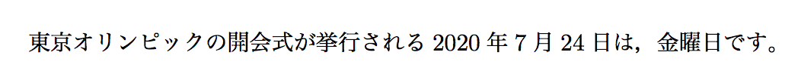
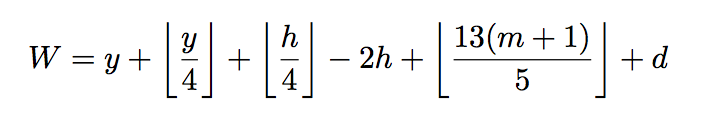
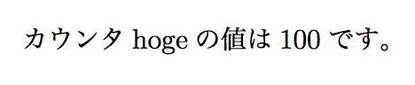

#曜日計算 - TeXにおけるカウンタの取り扱い

~~~ latex
\documentclass[uplatex]{jsarticle}

\makeatletter %文字@を利用できるようにする

\newcount\mycnth
\newcount\mycnty
\newcount\mycntm
\newcount\mycntd
\newcount\mycntW

\def\weekday#1#2#3{\bgroup
\mycnty=#1
\mycntm=#2
\mycntd=#3
%
\ifnum \mycntm<3
  \advance \mycnty by -1
  \advance \mycntm by 12
\fi
%
\mycnth=\mycnty
\divide\mycnth by 100
\@tempcnta=\mycnth
\multiply \@tempcnta by 100
\advance \mycnty by -\@tempcnta
%
\advance \mycntW by \mycnty
\divide \mycnty by 4
\advance \mycntW by \mycnty
%
\multiply \mycnth by2
\advance \mycntW by -\mycnth
\divide \mycnth by 8
\advance \mycntW by \mycnth
%
\advance \mycntm by 1
\multiply \mycntm by 13
\divide \mycntm by 5
\advance \mycntW by \mycntm
%
\advance \mycntW by \mycntd
%
\@tempcnta=\mycntW
\divide \@tempcnta by 7
\multiply \@tempcnta by 7
\advance \mycntW by -\@tempcnta
%
\ifcase \mycntW 土\or 日\or 月\or 火\or 水\or 木\or 金\fi
\egroup}

\makeatother %文字@を利用できない状態に戻す

\begin{document}

東京オリンピックの開会式が挙行される2020年7月24日は，\weekday{2020}{7}{24}曜日です。

\end{document}
~~~

（プリアンブル部が長ったらしくて気に食わない方は，styファイルとして別に保存し，`\usepackage`で呼び出すことも可能です。）

TeXを使って文章を作成する利点として，やはり様々な単純作業・計算を自動化できる点が挙げられます。そこで，TeXのカウンタの紹介を兼ねて，今回は「年月日を入力したら，その日の曜日を表示するマクロ」を作ってみたいと思います。

>追記：記事執筆後に，以下のマクロとほとんど同様の機能をもつ`\曜`というマクロが`okumacro.sty`に含まれていることが判明しました。
>結果として車輪の再発明的な記事に…

#ツェラーの公式
いきなりTeXソースを書き始めるのでは無く，まずはアルゴリズムを考えましょう。「曜日計算 公式」などで検索をかけると，次のような「ツェラーの公式」というものが見つかります。

h百y年m月d日の曜日を求めることを考えます。ただし，1,2月は前の年の13月,14月として計算します。（例えば2015年1月3日の場合，2014年13月3日とみなしてh=20, y=14, m=13, d=3となります）

この時，

を計算します。このWを7で割った余りをRとすると，曜日は次のように求まります。

|  R   |  0   |  1   |  2   |  3   |  4   |  5   |  6   |
| :--: | :--: | :--: | :--: | :--: | :--: | :--: | :--: |
| 曜日 |  土  |  日  |  月  |  火  |  水  |  木  |  金  |

これがツェラーの公式と呼ばれるものです。以下では，この計算をTeXで実装することを考えていきます。

>( http://www004.upp.so-net.ne.jp/s_honma/doweek.htm を参考にさせて頂きました)

#マクロの解説
上の計算を行うTeXソースは次の通りです。引数#1に年，引数#2に月，引数#3に日を入力することを想定しています。（簡単のため，前述のものに適宜コメントを追加しています）

~~~ latex
%%% 各種カウンタの準備 %%%%%%%%%%%%%%%
\newcount\mycnth
\newcount\mycnty
\newcount\mycntm
\newcount\mycntd
\newcount\mycntW
%
%%% 日付の設定 %%%%%%%%%%%%%%%%%%%%%%
\mycnty=#1 %ここではyは西暦4ケタそのままの値を代入してある
\mycntm=#2
\mycntd=#3
%%% 1月,2月の条件分岐 %%%%%%%%%%%%%%%%
\ifnum \mycntm<3
  \advance \mycnty by -1
  \advance \mycntm by 12
\fi
%
%%% カウンタh,yの準備(h,yの値を用意する)
\mycnth=\mycnty
\divide\mycnth by 100
\@tempcnta=\mycnth
\multiply \@tempcnta by 100
\advance \mycnty by -\@tempcnta
%
%%% Wにy,[y/4]を足す %%%%%%%%%%%%%%%%
\advance \mycntW by \mycnty
\divide \mycnty by 4
\advance \mycntW by \mycnty
%
%%% Wに-2h,[h/4]を足す %%%%%%%%%%%%%%
\multiply \mycnth by2
\advance \mycntW by -\mycnth
\divide \mycnth by 8
\advance \mycntW by \mycnth
%
%%% Wに[13(m+1/5)]を足す %%%%%%%%%%%%
\advance \mycntm by 1
\multiply \mycntm by 13
\divide \mycntm by 5
\advance \mycntW by \mycntm
%
%%% Wにdを足す %%%%%%%%%%%%%%%%%%%%%%
\advance \mycntW by \mycntd
%
%%% Wを7で割った余りを計算 %%%%%%%%%%%%
\@tempcnta=\mycntW
\divide \@tempcnta by 7
\multiply \@tempcnta by 7
\advance \mycntW by -\@tempcnta
%
%%% 余りに対応する曜日を出力 %%%%%%%%%%
\ifcase \mycntW 土\or 日\or 月\or 火\or 水\or 木\or 金\fi
~~~

（このマクロ内では`\@tempcnta`を取り扱っているため，使用例ではまず，texファイル中で文字@を使用するために必要な命令である`\makeatletter`を先に宣言し，また`\@tempcnta`をいじった影響が外部に波及するのを防ぐために`\bgroup`と`\egroup`で囲ってあります。）

以下では，このソースコードの完全理解を目指して，カウンタの用法を解説したいと思います。

##TeXにおけるカウンタの用法
TeXには，「カウンタ」という整数値を保存することができる変数型があります。通常の組版時には，章番号・節番号などを自動的に振るために使われますが，その機能を利用して，TeXで整数演算を行うことが可能です。

###カウンタの定義
カウンタを使うためには，まずはじめに`\newcount\(使いたいカウンタの名前)`という命令を用いてカウンタを定義する必要があります。今回のマクロでは，`\mycnth`（my_counter_hの意）などを最初に定義しました。もちろん，カウンタ名は`\hogecounter`など自分の好きな名前を用いれば良いのですが，`\a`など一文字のカウンタ名は，既に内部で使用するカウンタとして定義されている可能性が高いので，なるべく避けた方が良いです。

また，`\@tempcnta`（temporary_counter_aの意）は一時的に使われるカウンタとして，予めTeX内部で準備されているものです。今回のマクロでも，一時的に「ちょっとだけ」必要な部分で使用しています。同様に，`\@tempcntb`も一時的なカウンタとして用意されています。

また，カウンタの初期値は0です。つまり，

~~~ latex
\newcount\hoge
~~~

と定義した時点では，`\hoge`には0が代入されています。

###値の代入
カウンタに値を代入する作業は単純です。例えば，`\fuga`というカウンタに100を代入したい場合，

~~~ latex
\newcount\hoge %カウンタ\hogeを準備した
\hoge=100
~~~

とすれば良いだけです。今回は，`\mycnty`に引数#1を，`\mycntm`に引数#2を，`\mycntd`に引数#3を代入しています。（`\weekday{2020}{7}{24}`であれば，#1=2020, #2=7, #3=24ということです。）

###値の取り出し
カウンタの値を出力したい場合，`\the`という制御綴を使用します。すなわち，

~~~ latex
\newcount\hoge
\hoge=100

カウンタhogeの値は\the\hoge です。
~~~

というコードを実行すれば，以下のような出力が得られます。

###カウンタの四則演算
カウンタで四則演算をすることも出来ます。TeXには`\advance`や`\multiply`といった制御綴が用意されています。使い方は単純なので，以下のソースコードを見ればよく分かるでしょう。

~~~ latex
\newcount\piyo
\piyo=10 %\piyoに10を代入
\advance \piyo by 2 %\piyoに2を足す。以下，\piyoの値は12になる。
\multiply \piyo by 3 %\piyoを3倍する。以下，\piyoの値は36となる。
\advance \piyo by -5 %\piyoに-5を足す。以下，\piyoの値は31となる。
~~~

ただし割り算を実行する`\divide`だけは注意が必要です。多くのプログラム言語の整数型と同様に，**カウンタの割り算では商が返されます。** 次の例を見てください。

~~~ latex
\newcount\piyo
\piyo=10
\divide \piyo by 4
~~~

このコードを実行すると，`\piyo`の値は2.5でなく2となります。この性質は厄介に思われるかもしれませんが，今回のように床関数（ガウス記号）を考える場合には相性が良いと言えますね。

###条件分岐
カウンタの値によって読み込ませるコードを制御するためには，`\ifnum`や`\ifcase`を使います。用法は以下のとおりです。

~~~ latex
\ifnum (数orカウンタ1) (関係) (数orカウンタ2)
 (真の場合のコード) \else (偽の場合のコード)
\fi
~~~

~~~ latex
\ifcase (数orカウンタ) (数orカウンタが0の場合のコード) \or (1の場合) \or (2の場合) … \or (nの場合)
 \else (その他の場合)
\fi
~~~

例のように，TeXでは，if文は`\fi`という制御綴で閉じなければなりません。また，`\else`および偽の場合のコードは省略することも可能です。

###剰余を求めるテクニック
今回のマクロでは，以上で述べてきた要素を組み合わせて，TeX上でツェラーの公式の計算を実装しました。ただし，最後の「Wを7で割った余りを求める」という段階においては，TeXには剰余を直接求める制御綴がありませんので，テクニックで乗り切るしかありません。それについてご紹介します。

以下のコードをご覧ください。10わる4の余りを計算しています。

~~~ latex
\newcount\piyo
\piyo=10
\@tempcnta=\piyo %\@tempcntaに\piyoの値をコピー
\divide \@tempcnta by 4 %\@tempcntaが4で割られ，\@tempcntaの値が2になる。
\multiply \@tempcnta by 4 %\@tempcntaに4が掛かり，\@tempcntaの値が8になる。
\advance \piyo by -\@tempcnta　%剰余2が求まる。
~~~

このような，剰余を求めるテクニックは記憶に値します。

#LaTeX流のカウンタ用法
さて，これまで解説してきたカウンタの用法は，全てがTeX自体に実装されている機能です。しかし，実際に私たちがTeXとして目にするもののほとんどは，LaTeXと呼ばれるマクロパッケージを読み込んだTeXです。その場合，`\newcounter`や`\setcounter`などの，より高機能な制御綴を利用することもできます。それらについての解説は，この記事の趣旨からやや逸脱するので割愛しますが，「LaTeX カウンタ 用法」などで検索していただければ，文献が見つかると思います。これからもTeXプログラミングを楽しんでいただければ幸いです。

>（追記）LaTeX流のカウンタ用法については，本会のlatex.ltxリーディング第二回資料に詳しく紹介されています。そちらもぜひご参考に。