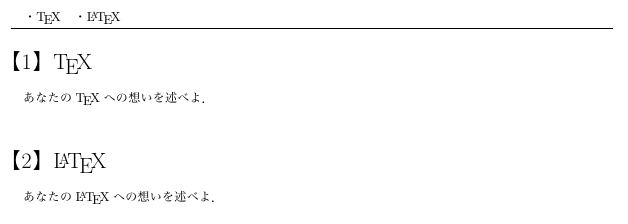
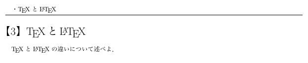

#設問環境の用意

~~~ latex
\documentclass{jsarticle}

\usepackage{fancyhdr}

\newcounter{probnumber} %設問番号
\def\pagecont{} %ヘッダーの中身

\newenvironment{prob}[1]{%
	\stepcounter{probnumber}
	\global\expandafter\def\expandafter\pagecont\expandafter{\pagecont \quad ・#1}
	\noindent{\LARGE【\theprobnumber】#1}\vspace{0.3cm}\par
}{\vspace{1.2cm}\par}

\pagestyle{fancy}
\lhead{\pagecont \global\def\pagecont{}}

\begin{document}

\begin{prob}{\TeX }
あなたの\TeX への想いを述べよ．
\end{prob}

\begin{prob}{\LaTeX }
あなたの\LaTeX への想いを述べよ．
\end{prob}

\newpage

\begin{prob}{\TeX と\LaTeX }
\TeX と\LaTeX の違いについて述べよ．
\end{prob}

\end{document}
~~~

TeXを用いて問題を作成したい，問題の解答を作成したい，といった場面は多々あるかと思います．
そのような場面で，統一的に大問を作成するためのマクロがあれば便利と考えるのは至って自然なことかと思います．
そこで，本記事では大問を作成し，更にページのヘッダーに，そのページ内にある設問の一覧を表示させるためのマクロを作成しました．
（本マクロではfancyhdr.styを利用しているので，これらがなければヘッダーへの表示はできません．勿論本文中の設問環境自体はfancyhdr.styを読み込まなくとも機能しますが．）

>追記：環境が切り替わる位置とページが切り替わる位置が一致した場合に正常に動作しないことがあるので，改ページの位置にはご注意ください．

##新しい環境の定義法

LaTeXでは`\newenvironment{環境名}[引数の数]{開始定義文（環境の始めに記述する内容）}{終了定義文（環境の終わりに記述する内容）}`というコマンドにより新しい環境を定義することができます．
ここで，開始定義文と終了定義文では，単に本文に表示させる文字列の他，何かしらの命令を書き込むこともできます．

例えば，以下の内容で定義された環境`sectiona`を用いることで，`\section`によって生成される通常の節の最後に「第◯節：××終了」という文字列を表示させることができます．

~~~ latex
\documentclass{jsarticle}

\newenvironment{sectiona}[1]{\section{#1}\def\secname{#1}}{\\ \\ \textbf{第\thesection 節：\secname \ 終了}\\ }

\begin{document}

\begin{sectiona}{\TeX の魅力}
\TeX は素晴らしい．
\end{sectiona}

\begin{sectiona}{\LaTeX の魅力}
\LaTeX も素晴らしい．
\end{sectiona}

\end{document}
~~~

ここで，環境の始めで一旦`\secname`に`#1`の中身，即ち節の名前を格納していますが，これは`\newenvironment`を用いて環境を作成した際，「環境の終わりに記述する内容」の中では`#1`を用いることができないためです．

##本設問環境の詳細

###環境名

今回の設問環境では，環境名として`prob`を設定しています．

###引数の数

今回の設問環境では，その設問の名称を与える引数をとりたかったので引数の数を1個としています．

###開始定義文

~~~ latex
\stepcounter{probnumber}
\global\expandafter\def\expandafter\pagecont\expandafter{\pagecont \quad ・#1}
\noindent{\LARGE【\theprobnumber】#1}\vspace{0.3cm}\par
~~~

今回の設問環境では，開始定義文を以上のものにしています．
これを順に見ていきます．

まず，環境外で用意したLaTeXカウンター`probnumber`に対し，`\stepcounter{probnumber}`と記述することで，その数を1増やしています．
これは，設問番号を1増やしたことに相当します．

続いて，`\global\expandafter\def\expandafter\pagecont\expandafter{\pagecont \quad ・#1}`により，`\pagecont`の末尾に`\ \ ・#1`を追加します．
すなわち，ヘッダーに表示する内容である`\pagecont`の末尾に，その設問の設問名を付け加えます．
ここで，最初に`\global`をつけてあるのは，`\pagecont`を環境の外であるヘッダーの編集の際に使用するためです．
また，`\expandafter`が3回用いられているのは，`\pagecont`の中身を一旦展開して，その末尾に`#1`をつけたものを再び`\pagecont`に格納するためです．
（`\expandafter`の使用法他，展開制御に関しては，後の人が詳細にまとめてくれることでしょう）

最後に，`\noindent{\LARGE【\theprobnumber】#1}\vspace{0.3cm}\par`で，本文中に`【\theprobnumber】`，すなわち設問番号と，`#1`，すなわち設問名を大きいサイズで表示させ，縦方向に適当な空白をとって改段落しています．
また，`\noindent`を用いることでインデントを防いでいます．

###終了定義文

~~~ latex
\vspace{1.2cm}\par
~~~

今回の設問環境では，終了定義文を以上のものにしています．
この内容で，縦方向に適当な余白をとった上で改段落しています．

###ヘッダーの編集

~~~ latex
\usepackage{fancyhdr}

\pagestyle{fancy}
\lhead{\pagecont \global\def\pagecont{}}
~~~
fancyhdrというパッケージを用いてヘッダーの編集を行っています．
ここでは，まずfancyhdr.styで提供されているページスタイルである`fancy`を用います．
各ページの左上に，そのページ内にある設問の一覧を表示させたいので，`\lhead{}`の引数として`\pagecont \global\def\pagecont{}`をとり，まずヘッダーに`\pagecont`の中身を表示させた上で，`\pagecont`の中身を空にしています．