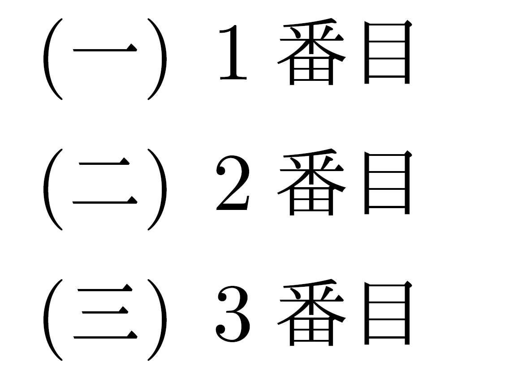

# 西暦から和暦・漢数字への変換

よくプログラミングの初歩で，西暦年を和暦に変換する関数の作成が取り上げられることがあります。今回は，TeXで西暦を和暦に変換し，それを漢数字で表示するマクロを作ってみました。さらに，1日単位での元号の変化に対応し，例えば昭和64年と平成1年も区別されるようにしました。

~~~ latex
\documentclass{jsarticle}

\makeatletter

\def\@kanji#1{%
  \ifcase#1 〇\or 一\or 二\or 三\or 四\or 五\or 六\or 七\or 八\or 九\or 十\or 十一\or 十二\or 十三\or 十四\or 十五\or 十六\or 十七\or 十八\or 十九\or 二十\or 二十一\or 二十二\or 二十三\or 二十四\or 二十五\or 二十六\or 二十七\or 二十八\or 二十九\or 三十\or 三十一\or 三十二\or 三十三\or 三十四\or 三十五\or 三十六\or 三十七\or 三十八\or 三十九\or 四十\or 四十一\or 四十二\or 四十三\or 四十四\or 四十五\or 四十六\or 四十七\or 四十八\or 四十九\or 五十\or 五十一\or 五十二\or 五十三\or 五十四\or 五十五\or 五十六\or 五十七\or 五十八\or 五十九\or 六十\or 六十一\or 六十二\or 六十三\or 六十四\or 六十五\or 六十六\or 六十七\or 六十八\or 六十九\or 七十\or 七十一\or 七十二\or 七十三\or 七十四\or 七十五\or 七十六\or 七十七\or 七十八\or 七十九\or 八十\or 八十一\or 八十二\or 八十三\or 八十四\or 八十五\or 八十六\or 八十七\or 八十八\or 八十九\or 九十\or 九十一\or 九十二\or 九十三\or 九十四\or 九十五\or 九十六\or 九十七\or 九十八\or 九十九 \else\@ctrerr\fi\relax}

\def\wareki#1#2#3{{%
\newcount \@ny
\newcount \@nds
\newcount \@doy
\newcount \@dom
\@ny = #1 \relax%年数
\@nds=#3\relax%任意の日付をひとつの整数で表す
\@doy=#1 \relax
\multiply \@doy by 372\relax
\@dom=#2 \relax
\multiply \@dom by 31\relax
\advance \@nds by \@doy\relax
\advance \@nds by \@dom\relax
%
\ifnum \@nds>739946%372*1989+31*1+7
\advance \@ny by -1988\relax
平成%
\else 
\ifnum \@nds>716868%372*1926+31*12+24
\advance \@ny by -1925\relax
昭和%
\else
\ifnum \@nds>711510%372*1912+31*7+29
\advance \@ny by -1911\relax
大正%
\else
\ifnum \@nds>694951%372*1868+31*1+24
\advance \@ny by -1867\relax
明治%
\fi\fi\fi\fi
\@kanji{\@ny}年\@kanji{#2}月\@kanji{#3}日}}

\makeatother

\begin{document}

2020年夏季オリンピックの開会式は，\wareki{2020}{7}{24}に挙行されます。\par
大日本帝国憲法が公布されたのは\wareki{1889}{2}{11}です。\par
\wareki{1989}{1}{7}\par
\wareki{1989}{1}{8}

\end{document}
~~~

## マクロの解説
### 漢数字への変換用テーブル
まず最初に，漢数字への変換用テーブルを準備しています。これは，LaTeXにおける箇条書きの番号を自分で定義したいときに使われる書き方で，例えばプリアンブルに

~~~ latex
\def\@kanji#1{%
  \ifcase#1 〇\or 一\or 二\or 三\or 四\or 五\or 六\or 七 \else\@ctrerr\fi\relax}%八以降は省略
\def\kanji#1{\expandafter\@kanji\csname c@#1\endcsname}%
\renewcommand{\labelenumi}{(\kanji{enumi})}
~~~

と再定義してから

~~~ latex
\begin{enumerate}
\item 1番目
\item 2番目
\item 3番目
\end{enumerate}
~~~

と書くと，以下のように出力されます。

これと同様にして，0から99までの値を漢数字に変換するテーブルを作りました。0から99まで，\orを挟んで全て漢数字で書き並べてありますが，私はこのコードを，エ●セルのオートフィルを使って半自動的に出力しました。

### 西暦年月日からひとつの整数への変換
初歩的なプログラミングでは，西暦年の値によって条件分岐し，元号を変えることが多いですが，今回は，1日単位での元号の変化への対応を試みました。しかし，年，月，日でそれぞれ条件分岐するのではコードが冗長になってしまうので，西暦年月日をひとつの整数に変換し，その値だけに応じて条件分岐することにしました。その「ひとつの整数」が，今回のプログラムにおける\@ndsです。
少なくとも，日本中で広く使われているグレゴリオ暦による暦法では，1年は多くて12か月，366日であり，1か月は多くて31日ですから，グレゴリオ暦y年m月d日を，(31*12)y+31m+dというひとつの整数に変換すれば，その整数に対応するy，m，dの組み合わせは一意に定まるか，対応するものがないかのどちらかであり，y，m，dの組み合わせが複数考えられることはありません。
そこで，この値を\@ndsとして利用しています。
また，より新しい，未来の日付の方が，必ず\@ndsの値も大きくなるので，\@ndsの大きさに応じて元号を判定することができます。

カウンタの準備や四則演算については，第3週で説明されています。

### 元号の判定
\@ndsの値の設定が終わったら，\ifnumで条件分岐し，元号を判定します。ここでは，

* 平成　1989年1月8日以降
* 昭和　1926年12月25日～1989年1月7日
* 大正　1912年7月30日～1926年12月24日
* 明治　1868年1月25日～1912年7月29日

とし，元号の境目の日は新しい方の元号に合わせました。これ以前の日付を入力した場合はエラーが返されます。

なお，日本でグレゴリオ暦が採用されたのは1872年で，明治5年12月2日の翌日が明治6年1月1日（グレゴリオ暦の1873年1月1日）とされたため，それ以前の日付は正しく出力されません。（http://ja.wikipedia.org/wiki/%E3%82%B0%E3%83%AC%E3%82%B4%E3%83%AA%E3%82%AA%E6%9A%A6）

そして，例えば元号が平成なら，西暦年から1988を引くことで和暦年を得られます。この計算をし，最初に用意したテーブルを使って漢数字へ変換して，無事和暦・漢数字で出力することができました。

追記：この記事執筆後に，漢数字への変換として，
pTeXのプリミティブ \kansuji (http://ascii.asciimw.jp/pb/ptex/help/kansuji.html)
Xkansujiパッケージ (https://github.com/tattsan/xkansuji/wiki/texadventar14)
があることを知りました。西暦年など大きな数を漢数字で表す場合などは，今回のマクロでは対応できませんね。